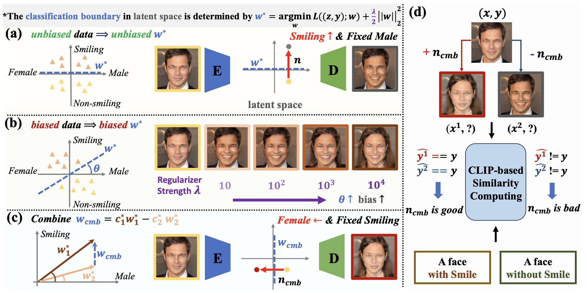
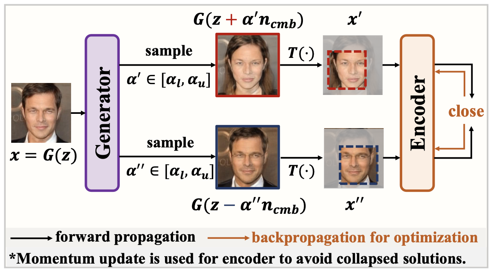
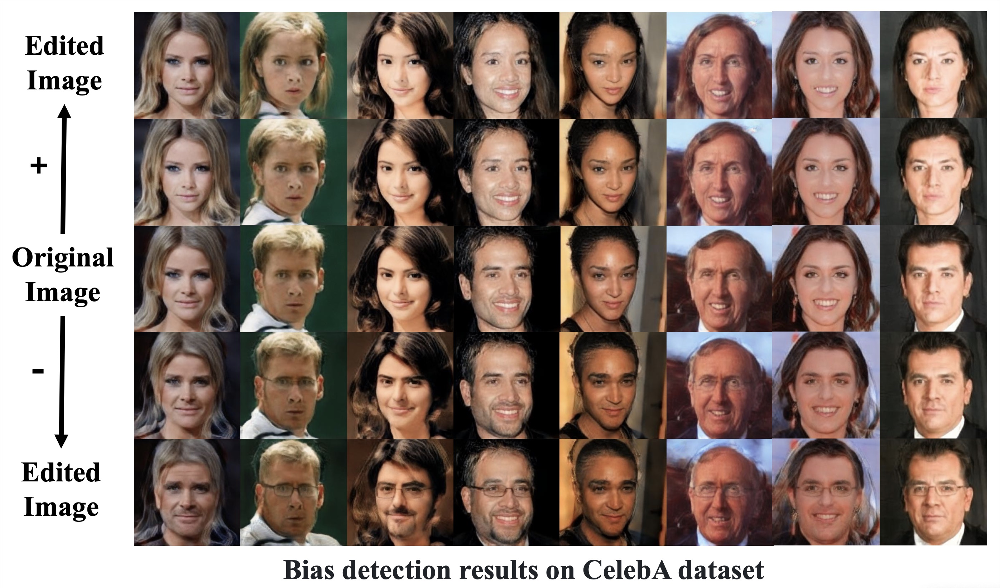

# DiGA: Distributionally Generative Augmentation for Fair Facial Attribute Classification (CVPR 2024)

> Distributionally Generative Augmentation for Fair Facial Attribute Classification   
> https://arxiv.org/pdf/2403.06606


<!-- ## Introduction

  

   -->




## Set up
### Installation
```
git clone https://github.com/heqianpei/DiGA.git
cd DiGA
```

### Environment
The environment can be simply set up by Anaconda:
```
conda create -n DiGA python=3.8
conda activate DiGA
pip install torch==1.9.1+cu102 torchvision==0.10.1+cu102 torchaudio==0.9.1 -f https://download.pytorch.org/whl/torch_stable.html
pip install matplotlib
conda install ninja
conda install -c 3dhubs gcc-5
```


## Bias Detection
### Preparation
1. Download datasets [CelebA](https://mmlab.ie.cuhk.edu.hk/projects/CelebA.html) (Align&Cropped Images) and put dataset into `./data`.
2. Cut the datasets to get biased datasets.
```
python ./data/cut_dataset.py
```
3. Download some pretrained models and put them in `./pretrained`.

| Model | Description
| :--- | :----------
|[StyleGAN2 (FFHQ)](https://drive.google.com/file/d/1EM87UquaoQmk17Q8d5kYIAHqu0dkYqdT/view?usp=sharing) | Pretrained face generator on FFHQ  from [rosinality](https://github.com/rosinality/stylegan2-pytorch).
|[e4e (FFHQ)](https://drive.google.com/file/d/1cUv_reLE6k3604or78EranS7XzuVMWeO/view?usp=sharing) | Pretrained initial encoder on FFHQ  from [omertov](https://github.com/omertov/encoder4editing).
|[Feature extractor](https://drive.google.com/file/d/1KW7bjndL3QG3sxBbZxreGHigcCCpsDgn/view?usp=sharing) | Pretrained IR-SE50 model taken from [TreB1eN](https://github.com/TreB1eN/InsightFace_Pytorch) for ID loss calculation.


### Train Biased Generative Modeling
Modify `option` and `train_generative_model.sh` and run:
```
bash train_generative_model.sh
```

### Get Semantic Directions and Optimal Combination Coefficients
Run `grid_search.sh` to get the semantic directions, combine directions, edit some test images and choose optimal combination coefficients. The combination coefficients yielding the highest accuracy in the output are the optimal combination coefficients.
```
bash grid_search.sh
```


## Bias Mitigation
1. Change parameter $choose$ to optimal combination coefficient from `grid_search.sh` output.
2. Run `train_classifier.sh` to train fair encoder and train fair classifier.
```
bash train_classifier.sh
```


## Citation
If you find this work useful for your research, please cite:

``` 
@inproceedings{
  title={Distributionally Generative Augmentation for Fair Facial Attribute Classification},
  author={Fengda Zhang, Qianpei He, Kun Kuang, Jiashuo Liu, Long Chen, Chao Wu, Jun Xiao, Hanwang Zhang},
  booktitle = {Proceedings of the IEEE/CVF Conference on Computer Vision and Pattern Recognition (CVPR)},
  year={2024}
}
```

## Acknowledgement
Thanks to [Tengfei-Wang](https://github.com/Tengfei-Wang/HFGI) for sharing their code.

